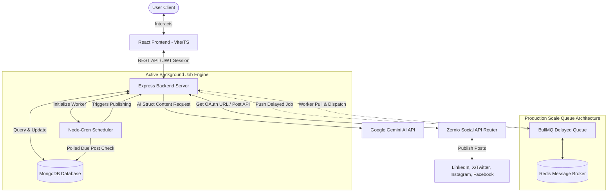

# AutoPostAI 

An enterprise-grade, AI-powered social media management and scheduling SaaS platform. It allows users to generate tailored, platform-specific content using Google Gemini AI, connect social accounts securely via OAuth (powered by Zernio), and automate scheduling and publishing with a background worker engine.

---

## 🛡️ Tech Badges & Frameworks


---

## 🔗 Demo Links & Visuals

* 🌐 **Live Demo:** [https://autopostai.vercel.app](https://autopostai.vercel.app) *(Placeholder)*
*  **Frontend Web App:** [https://github.com/MANJEET-SINGH766/AutoPostAI/tree/main/client](https://github.com/MANJEET-SINGH766/AutoPostAI/tree/main/client)
*  **Backend Service API:** [https://github.com/MANJEET-SINGH766/AutoPostAI/tree/main/server](https://github.com/MANJEET-SINGH766/AutoPostAI/tree/main/server)

###  Product Walkthrough Video
*  **Demo Video:** [Watch the walkthrough on YouTube](https://youtube.com) *(Placeholder)*

---

##  Features

-  **AI-Powered Copywriting**: Harness Google Gemini AI (`gemini-3.5-flash`) to generate high-performing posts optimized for specific platforms (LinkedIn, X/Twitter, Instagram, Facebook), tailored to tone, audience, length, and structured JSON formatting.
-  **Multi-Platform OAuth Connections**: Securely link LinkedIn, Twitter/X, Instagram, and Facebook profiles in a unified dashboard leveraging **Zernio** API integrations.
-  **Robust JWT Authentication**: State-of-the-art password hashing with Bcrypt.js and secure access session validation via JSON Web Tokens.
- **Smart Post Scheduling**: Setup publish times with an automated scheduler daemon tracking MongoDB records and triggering precise publishing schedules.
- **Background Queue Ready**: Optimized for scaling with BullMQ and Redis brokers for distributed task queuing in production-grade deployments.
- **Sleek Responsive Dashboard**: A responsive modern SaaS dashboard built on Vite, React 19, Tailwind CSS 4, and Lucide React.
- **MongoDB Storage**: Schemas designed with Mongoose, ensuring data integrity, cascading updates, and populating queries.
- **Multipart Media Uploads**: Built-in static public upload service powered by Multer for attachments.

---

##  Tech Stack

| Layer | Technology | Usage Description |
|:---|:---|:---|
| **Frontend** | React 19, TypeScript, React Router, Vite | User Interface, routing, client state management |
| **Styling** | Tailwind CSS v4, Lucide React | Modern styling, component layout, and iconography |
| **Backend** | Node.js, Express.js | Core REST API design, middleware, and backend logic |
| **Database** | MongoDB, Mongoose | Schema definitions for Users, Social Accounts, and Posts |
| **Auth** | JSON Web Tokens (JWT), Bcrypt.js | Password hashing and session token verification |
| **Scheduler** | Node-Cron | Local environment daemon checking database schedules every minute |
| **Production Queues** | BullMQ & Redis | Scalable background tasks and pub/sub worker queue |
| **AI Integration** | @google/genai | Structured generation using the `gemini-3.5-flash` model |
| **Social API Connection**| @zernio/node SDK | Platform connection management and post publishing |

---

## Project Architecture



---

##  Folder Structure

```
AutoPostAI/
├── client/
│   └── social-media/                  # React 19 & Vite 8 frontend app
│       ├── public/                    # Static assets (images, icons)
│       ├── src/
│       │   ├── assets/                # Graphic assets
│       │   ├── components/            # Shared UI components
│       │   │   ├── Home/              # Landing page landing items
│       │   │   ├── Layout.tsx         # Dashboard sidebar layout wrapper
│       │   │   └── Sidebar.tsx        # Responsive navigation sidebar
│       │   ├── pages/                 # Routing page views
│       │   │   ├── AIComposer.tsx     # Gemini interactive writing panel
│       │   │   ├── Accounts.tsx       # Channel connect & status page
│       │   │   ├── Dashboard.tsx      # Main schedule stats dashboard
│       │   │   ├── Home.tsx           # Product marketing home page
│       │   │   ├── Login.tsx          # JWT Login page
│       │   │   └── Scheduler.tsx      # Calendar scheduling feed panel
│       │   ├── services/
│       │   │   └── api.ts             # Axios API middleware instance
│       │   ├── App.tsx                # Client Routing configuration
│       │   ├── index.css              # Custom styling definitions
│       │   └── main.tsx               # App startup bootstrap mount
│       ├── eslint.config.js
│       ├── index.html
│       ├── package.json
│       ├── tsconfig.json
│       └── vite.config.ts
├── server/                            # Node & Express backend application
│   ├── config/
│   │   └── db.js                      # MongoDB Atlas connection handler
│   ├── controllers/                   # Core business controllers
│   │   ├── aiController.js            # Handles Gemini request validation
│   │   ├── authController.js          # Handles JWT login and register
│   │   ├── postController.js          # Handles CRUD and cancel logic for posts
│   │   └── socialAuthController.js    # Zernio OAuth connect/callback/disconnect
│   ├── jobs/
│   │   └── publishScheduled.js        # Node-Cron task checking database every min
│   ├── middleware/
│   │   └── auth.js                    # JWT extraction & protect route filter
│   ├── models/                        # Mongoose schemas
│   │   ├── Post.js                    # Content metadata, schedule datetime, status
│   │   ├── SocialAccount.js           # Account status, Zernio token, username mapping
│   │   └── User.js                    # Registered users, Zernio profile link
│   ├── public/
│   │   └── uploads/                   # Multipart uploaded image storage directory
│   ├── routes/                        # Express API route maps
│   │   ├── aiRoutes.js
│   │   ├── auth.js
│   │   ├── posts.js
│   │   └── socialAuth.js
│   ├── services/                      # API wrapper abstractions
│   │   ├── geminiService.js           # Google GenAI model settings and formatting
│   │   └── linkedinServices.js
│   ├── app.js                         # Main Express application initialization
│   ├── index.js                       # Primary web entry point file
│   └── package.json
├── .gitignore                         # Multi-level gitignore filters
├── package.json                       # Workspace shortcuts for concurrency
└── README.md
```

---

## Installation & Local Setup

### Prerequisites
* **Node.js** (v18.x or higher)
* **MongoDB** (Atlas cluster or local service)
* **Redis** (Local instance or Upstash - optional for scale production config)

### 1. Clone Project
```bash
git clone https://github.com/MANJEET-SINGH766/AutoPostAI.git
cd AutoPostAI
```

### 2. Install Root Workspace Dependencies
```bash
npm install
```

### 3. Install Server Dependencies
```bash
cd server
npm install
cd ..
```

### 4. Install Client Dependencies
```bash
cd client/social-media
npm install
cd ../..
```

### 5. Setup Environment Variables
Create a `.env` file in the `/server` folder. Refer to the table below to configure the correct variables.

### 6. Run Project Locally
Run both client and server concurrently using the root shortcut:
```bash
npm run dev
```
* **Frontend Access**: [http://localhost:5173](http://localhost:5173)
* **Backend Endpoint**: [http://localhost:3000](http://localhost:3000)

---

##  Environment Variables

| Variable Name | Required | Default Value | Description |
|:---|:---:|:---|:---|
| `PORT` | No | `3000` | Port for the backend API |
| `MONGODB_URI` | Yes | - | MongoDB connection string (Local or Atlas) |
| `JWT_SECRET` | Yes | - | Secret string used to sign JWT session hashes |
| `GEMINI_API_KEY` | Yes | - | API key obtained from Google AI Studio |
| `ZERNIO_API_KEY` | Yes | - | Client API access key for Zernio OAuth service |
| `REDIS_URL` | No | `redis://127.0.0.1:6379` | Connection string for Redis Broker |
| `SERVER_URL` | No | `http://localhost:3000` | Full address of server (used for uploads/callbacks) |
| `CLIENT_URL` | No | `http://localhost:5173` | Address of frontend app (for CORS policies) |

---

## API Endpoints

###  Auth API
* **Base URL**: `/api/auth`

| Method | Endpoint | Description | Auth Required |
|:---:|:---|:---|:---:|
| `POST` | `/register` | Sign up a new user account | ❌ No |
| `POST` | `/login` | Authorize email/password and returns JWT | ❌ No |

###  AI API
* **Base URL**: `/api/ai`

| Method | Endpoint | Description | Auth Required |
|:---:|:---|:---|:---:|
| `POST` | `/generate` | Generate post text structured in JSON via Gemini | ✔️ Yes |

###  Posts API
* **Base URL**: `/api/posts`

| Method | Endpoint | Description | Auth Required |
|:---:|:---|:---|:---:|
| `GET` | `/` | Fetch all user's scheduled/published posts | ✔️ Yes |
| `POST` | `/schedule` | Save and queue a new post to the system | ✔️ Yes |
| `POST` | `/:id/cancel` | Stop a pending post from publishing | ✔️ Yes |
| `DELETE` | `/:id` | Permanently delete post from database | ✔️ Yes |
| `POST` | `/upload` | Multipart upload media and return public static link | ✔️ Yes |

### 🔗 Social Connection API
* **Base URL**: `/api/social-auth`

| Method | Endpoint | Description | Auth Required |
|:---:|:---|:---|:---:|
| `GET` | `/connect/:platform` | Retrieve Zernio OAuth authentication redirect URL | ✔️ Yes |
| `GET` | `/callback` | OAuth redirect landing callback | ❌ No |
| `GET` | `/sync` | Fetch user's currently active social connections | ✔️ Yes |
| `DELETE` | `/:id` | Disconnect and revoke social profile credentials | ✔️ Yes |

---

##  Core Workflows

###  Authentication Flow
```
[Client Login Input] ──> [Verify Credentials (Mongoose)] 
                                 │
                                 ▼
                     [Sign JWT (JWT_SECRET)] ──> [Send Token to Client]
                                                       │
                                                       ▼
[Request Protected API] <── [Verify Bearer Token] <── [Attach Token to Header]
```

###  Scheduling Workflow
```
[User Selects Schedule Time] ──> [Save to MongoDB as "pending"]
                                         │
                                         ▼
                             [Node-Cron minute polling]
                                         │
                                         ▼ (Current Date >= scheduledAt)
                              [Change status to "processing"]
                                         │
                                         ▼
                             [Call Zernio API publish] ──> [Set status to "completed"]
```

###  AI Copywriting Workflow
```
[Topic + Tone Prompt Options] ──> [Build Strict Platform Prompt Rules]
                                                 │
                                                 ▼
                                     [Request Gemini Model]
                                                 │
                                                 ▼
[Populate Editor Box] <── [Parse structured JSON Response]
```

---

##  Screenshots

* **Dashboard Overview**
  
* **AI Writer Panel (Gemini)**
  
* **Scheduler Feed**
  
* **Channel Integrations**
  

---

##  Deployment Instructions

### Frontend (Vercel)
1. Import repository to Vercel.
2. In Build settings, configure Framework Preset to `Vite`.
3. Set the directory root to `client/social-media`.
4. Configure environment variable `VITE_API_URL` pointing to backend API.

### Backend (Render)
1. Import repository to Render.
2. Create a Web Service and specify the project root folder to `server`.
3. Set Build Command: `npm install`
4. Set Start Command: `npm start`
5. Configure environment variables (`MONGODB_URI`, `JWT_SECRET`, `GEMINI_API_KEY`, `ZERNIO_API_KEY`).

### Database (MongoDB Atlas)
1. Create a free shared cluster.
2. Go to **Network Access** and whitelist `0.0.0.0/30` or deployment server IP.
3. Copy connection string and configure `MONGODB_URI`.

### Queue Broker (Upstash Redis)
1. Register on Upstash and launch a Serverless Redis instance.
2. Copy the endpoint address (`redis://...`) and configure `REDIS_URL` in backend.

---

##  Future Enhancements

-  **Multi-Image Attachments**: Allow scheduling posts with multiple images or carousel frames.
-  **Team Workspaces**: Enable collaboration features, approvals, and shared team assets.
-  **Unified Analytics**: Tracking engagement stats, likes, comments, and impressions natively.
-  **AI Hashtag Suggestion**: Real-time context-aware hashtag generation tool inside composer.
-  **AI Image Creation**: Integrations with Imagen/DALL-E to generate graphics from text directly.
- **Interactive Calendar View**: Drag-and-drop posts between dates to reschedule visual calendars.

---

##  Contributing

Contributions make the open-source community an amazing place to learn, inspire, and create.
1. Fork the Project.
2. Create your Feature Branch (`git checkout -b feature/AmazingFeature`).
3. Commit your Changes (`git commit -m 'Add some AmazingFeature'`).
4. Push to the Branch (`git push origin feature/AmazingFeature`).
5. Open a Pull Request.

---

##  License
This project is open-source, licensed under the **MIT License**. See `LICENSE` for more information.

---

##  Author

**Manjeet Singh**
* 🐙 **GitHub Profile**: [@MANJEET-SINGH766](https://github.com/MANJEET-SINGH766)
*  **LinkedIn Profile**: [LinkedIn](https://linkedin.com) *(Placeholder)*
*  **Email**: [singhmanjeet766853@gmail.com](mailto:singhmanjeet766853@gmail.com)
